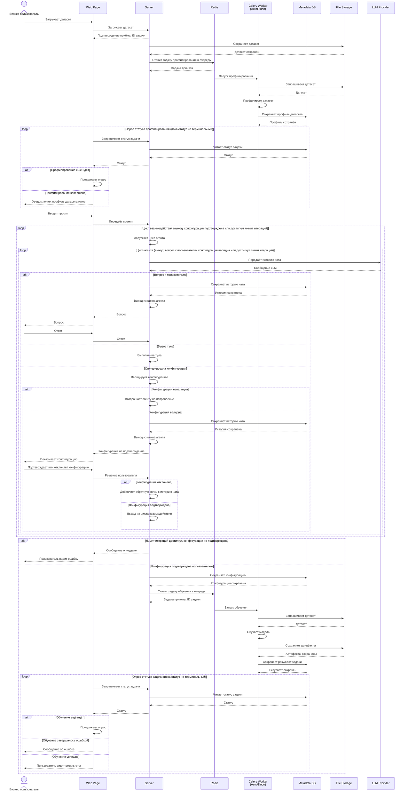

```mermaid
sequenceDiagram
    actor user as Бизнес пользователь
    participant page as Web Page
    participant server as Server
    participant redis as Redis
    participant worker as Celery Worker<br>(AutoGluon)
    participant database as Metadata DB
    participant storage as File Storage
    participant provider as LLM Provider

    user ->>page: Загружает датасет
    page ->> server: Загружает датасет
    server -->> page: Подтверждение приёма, ID задачи
    server ->> storage: Сохраняет датасет
    storage -->> server: Датасет сохранён
    server ->> redis: Ставит задачу профилирования в очередь
    redis -->> server: Задача принята
    redis ->> worker: Запуск профилирования
    worker ->> storage: Запрашивает датасет
    storage -->> worker: Датасет
    worker ->> worker: Профилирует датасет
    worker ->> database: Сохраняет профиль датасета
    database -->> worker: Профиль сохранён

    loop Опрос статуса профилирования (пока статус не терминальный)
        page ->> server: Запрашивает статус задачи
        server ->> database: Читает статус задачи
        database -->> server: Статус
        server -->> page: Статус
        alt Профилирование ещё идёт
            page ->> page: Продолжает опрос
        else Профилирование завершено
            page -->> user: Уведомление: профиль датасета готов
        end
    end

    user ->> page: Вводит промпт
    page ->> server: Передаёт промпт

    loop Цикл взаимодействия (выход: конфигурация подтверждена или достигнут лимит итераций)
        server ->> server: Запускает цикл агента

        loop Цикл агента (выход: вопрос к пользователю, конфигурация валидна или достигнут лимит итераций)
            server ->> provider: Передаёт историю чата
            provider -->> server: Сообщение LLM

            alt Вопрос к пользователю
                server ->> database: Сохраняет историю чата
                database -->> server: История сохранена
                server ->> server: Выход из цикла агента
                server -->> page: Вопрос
                page -->> user: Вопрос
                user ->> page: Ответ
                page ->> server: Ответ
            else Вызов тула
                server ->> server: Выполнение тула
            else Сгенерирована конфигурация
                server ->> server: Валидирует конфигурацию

                alt Конфигурация невалидна
                    server ->> server: Возвращает агенту на исправление
                else Конфигурация валидна
                    server ->> database: Сохраняет историю чата
                    database -->> server: История сохранена
                    server ->> server: Выход из цикла агента
                    server -->> page: Конфигурация на подтверждение
                    page -->> user: Показывает конфигурацию
                    user ->> page: Подтверждает или отклоняет конфигурацию
                    page ->> server: Решение пользователя

                    alt Конфигурация отклонена
                        server ->> server: Добавляет обратную связь в историю чата
                    else Конфигурация подтверждена
                        server ->> server: Выход из цикла взаимодействия
                    end
                end
            end
        end
    end

    alt Лимит итераций достигнут, конфигурация не подтверждена
        server -->> page: Сообщение о неудаче
        page -->> user: Пользователь видит ошибку
    else Конфигурация подтверждена пользователем
        server ->> database: Сохраняет конфигурацию
        database -->> server: Конфигурация сохранена
        server ->> redis: Ставит задачу обучения в очередь
        redis -->> server: Задача принята, ID задачи
        redis ->> worker: Запуск обучения
        worker ->> storage: Запрашивает датасет
        storage -->> worker: Датасет
        worker ->> worker: Обучает модель
        worker ->> storage: Сохраняет артефакты
        storage -->> worker: Артефакты сохранены
        worker ->> database: Сохраняет результат задачи
        database -->> worker: Результат сохранён

        loop Опрос статуса задачи (пока статус не терминальный)
            page ->> server: Запрашивает статус задачи
            server ->> database: Читает статус задачи
            database -->> server: Статус
            server -->> page: Статус
            alt Обучение ещё идёт
                page ->> page: Продолжает опрос
            else Обучение завершилось ошибкой
                page -->> user: Сообщение об ошибке
            else Обучение успешно
                page -->> user: Пользователь видит результаты
            end
        end
    end
```
