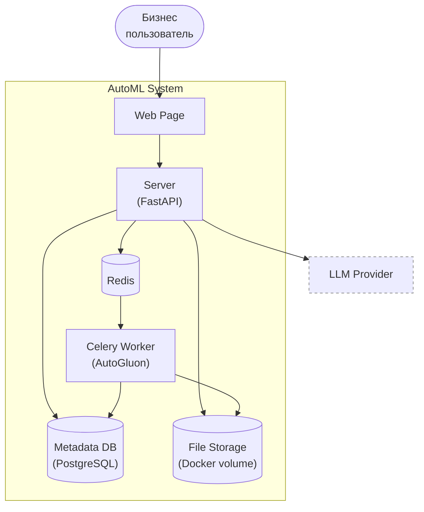

# Диаграмма контейнеров (C4 - L2)

```mermaid
flowchart TB
    classDef external stroke:#888888,stroke-dasharray: 4 4

    user(["Бизнес\nпользователь"])

    subgraph automl ["AutoML System"]
        direction TB
        webpage["Web Page"]
        server["Server\n(FastAPI)"]
        worker["Celery Worker\n(AutoGluon)"]
        redis[("Redis")]
        db[("Metadata DB\n(PostgreSQL)")]
        storage[("File Storage\n(Docker volume)")]
    end

    provider["LLM Provider"]:::external

    user --> webpage
    webpage --> server
    server --> provider
    server --> redis
    server --> db
    server --> storage
    redis --> worker
    worker --> db
    worker --> storage
```
