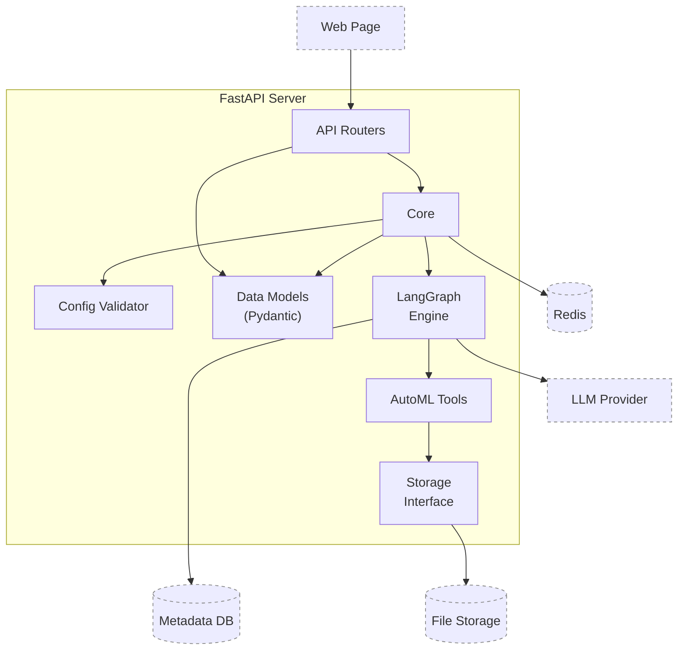

# Диаграмма компонента - Server (C4 - L3)

```mermaid
flowchart TB
    classDef external stroke:#888888,stroke-dasharray: 4 4

    webpage["Web Page"]
    provider["LLM Provider"]
    redis[("Redis")]
    database[("Metadata DB")]
    storage[("File Storage")]

    subgraph server ["FastAPI Server"]
        direction TB
        api["API Routers"]
        core["Core"]
        validator["Config Validator"]
        models["Data Models\n(Pydantic)"]
        langgraph["LangGraph\nEngine"]
        tools["AutoML Tools"]
        storage_if["Storage\nInterface"]
    end

    class webpage,provider,redis,database,storage external

    webpage --> api

    api --> core
    api --> models

    core --> langgraph
    core --> redis
    core --> models
    core --> validator

    langgraph --> provider
    langgraph --> database
    langgraph --> tools

    tools --> storage_if
    storage_if --> storage

    storage_if ~~~ database
```
