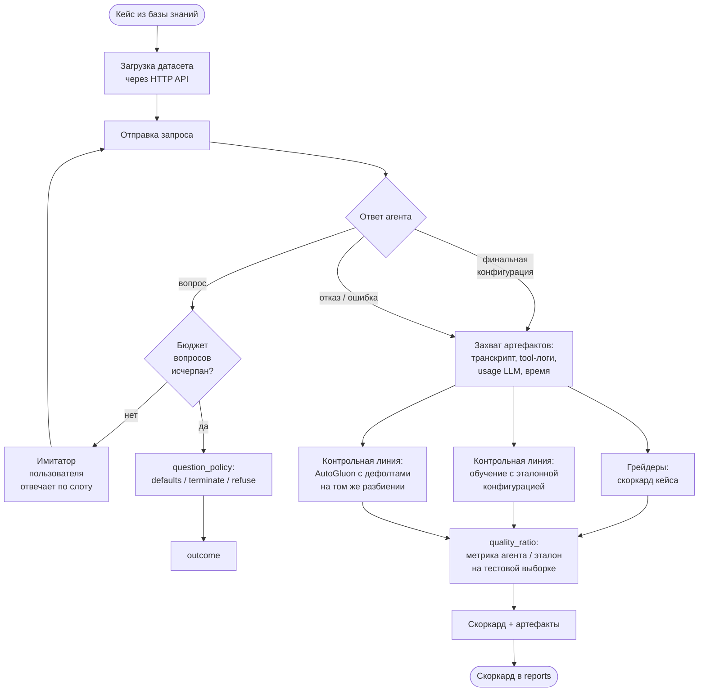

# Процесс тестирования

Документ описывает процесс тестирования кейса.

```mermaid
flowchart TD
    start(["Кейс из базы знаний"]) --> upload[Загрузка датасета\nчерез HTTP API]
    upload --> send["Отправка запроса"]
    send --> turn{Ответ агента}

    turn -->|вопрос| budget{Бюджет\nвопросов\nисчерпан?}
    budget -->|нет| sim["Имитатор\nпользователя\nотвечает по слоту"]
    sim --> send
    budget -->|да| policy["question_policy:\ndefaults / terminate / refuse"]
    policy --> outcome

    turn -->|финальная\nконфигурация| capture["Захват артефактов:\nтранскрипт, tool-логи,\nusage LLM, время"]
    turn -->|отказ / ошибка| capture

    capture --> score["Грейдеры:\nскоркард кейса"]
    capture --> control["Контрольная линия:\nобучение с эталонной\nконфигурацией"]
    capture --> defaults["Контрольная линия:\nAutoGluon с дефолтами\nна том же разбиении"]
    score --> quality["quality_ratio:\nметрика агента / эталон\nна тестовой выборке"]
    control --> quality
    defaults --> quality
    quality --> mlflow["Скоркард + артефакты"]
    mlflow --> done(["Скоркард в reports"])
```
